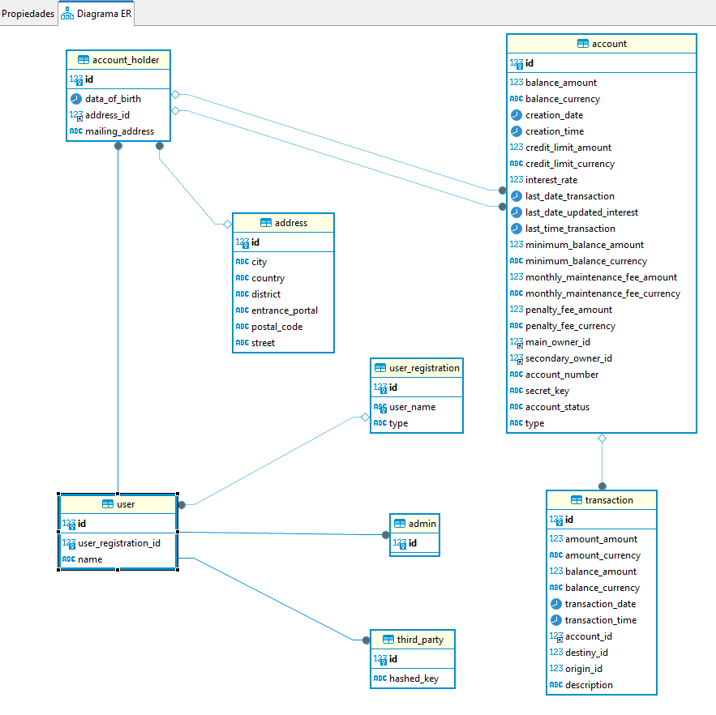

# Bank Application
## Descripción del Proyecto
Bank Application es una aplicación bancaria desarrollada con **Spring Boot** que permite gestionar diferentes aspectos de una entidad bancaria, incluyendo cuentas, transacciones, administradores, terceros y titulares de cuentas. La aplicación facilita la administración de registros de usuarios con distintos roles y realiza operaciones bancarias básicas.
## Diagrama de Clases
A continuación se incluye un diagrama de clases que muestra la estructura y relaciones entre las entidades principales del proyecto:


Escogimos el Account como objeto unico como cuenta, diferenciandolo con unos enumeradores que podiran ser de los diferentes tipos de cuentas, ahorros, cuenta corriente, cuenta de estudiante y tarjeta de credito.
Pensamos que así era la mejor manera para la implementación de las diversas operaciones propias de las cuentas. Ya que al tenerlo todo unificado nos resultaba más sencillo poder manipularlas.
En el caso de los usuarios, allí optamos por una clase padre User, de las que heredan tres tipos de usuario; admin, third y holder. Esta clase padre enlaza con una relación oneToOne con la clase  registroDeUsuario.
Las otras relaciones que tenemos entre clases son;
Las cuentas estan relacionadas con sus transacciones.
Y los titulares estan relacionados con sus direcciones y estos a su vez a las cuentas.
Tambien implementamos una clase Money que nos venia predeterminada, para usarla en los atributos de tipo moneda.
Dependiendo del tipo de cuenta tiene unos valores predeterminados y unos margenes en las modificaciones que hemos gestionado desde los Setters de los propios atributos.
Nuestra manera de colaborar ha sido mediante github con cada uno sus propias ramas.
## Configuración
Para configurar el proyecto, sigue estos pasos:
1. **Clonar el Repositorio**:
   ```bash
   git clone https://github.com/Montsita/bankApplication
## Tecnologías utilizadas
Spring Boot: Framework principal para la creación de aplicaciones basadas en Spring.
Spring Data JPA: Para la gestión de la persistencia y operaciones en la base de datos.
MySQL: Base de datos utilizada (puede ser cambiada según la configuración).
Maven: Herramienta de construcción y gestión de dependencias.
## Estructura de controladores y rutas
AccountHolderController
- GET /accountHolder: Retorna todos los titulares de cuentas.
- GET /accountHolder/{id}: Retorna un titular de cuenta por ID.

AdminController
- GET /admin: Retorna todos los administradores.
- GET /admin/{id}: Retorna un administrador por ID.
TransactionController
- GET /transaction: Retorna todas las transacciones.
- GET /transaction/{id}: Retorna una transacción por ID.
UserRegistrationController
- GET /userRegistration: Retorna todos los registros de usuarios.
- GET /userRegistration/{id}: Retorna un registro de usuario por ID.
- GET /userRegistration/find/{userName}: Retorna un registro de usuario por nombre de usuario.
AddressController:
- (Vacío en esta versión, pero está preparado para futuras funcionalidades)
ThirdPartyController
- GET /thirdParty: Retorna todos los terceros.
- GET /thirdParty/{id}: Retorna un tercero por ID.
## Enlaces adicionales
   [Enlace a diapositivas](https://www.canva.com/design/DAGRB0afnKk/duGju20lI34TmN87LFvsJg/edit)
## Trabajo futuro
Estructura controladores: 
- Terminar acceso de usuarios y operaciones con cuentas.
- Seguridad Avanzada: Integrar Spring Security o JWT para una gestión robusta de autenticación y autorización.
## Recursos
- Profesor Jarko Garrido
- ChatGPT
- Material didáctico
## Miembros del equipo
- Yasmin - ejeccución de la aplicación.
- Montserrat Cobes - ejeccución de la aplicación.
- Jose Antonio Grima - ejeccución de la aplicación.


